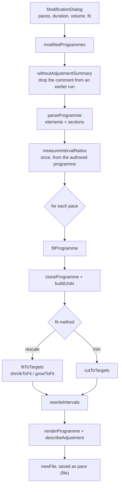

# Programme adjustment

This note covers the rework of the **Modify Programme** feature on the
`feat/set-duration-adjustment` branch: what changed, how it works now, and why
it was built this way.

The feature takes one SwimDSL programme and writes out a version of it for
each swimmer pace entered in the modification dialog. Each version gets
intervals recalculated for that pace and is then fitted to the session's
duration and/or volume. Fitting works one of two ways:

- **Adjust the sets to fit** (`rescale`, the default). Sets are resized, down
  or up. The main set is protected, later sets change before earlier ones,
  and extra volume goes mostly to repeated sets.
- **Stop when the time runs out** (`trim`). Sets are kept exactly as written,
  and the programme ends at the point where the session runs out.

Because each pace's version fills the same session, the training load
(average pace × volume) stays close to equal across swimmers of different
speeds.

## Contents

1. [Summary of changes](#summary-of-changes)
2. [Why the modifier was rewritten](#why-the-modifier-was-rewritten)
3. [Architecture](#architecture)
4. [How a programme is timed](#how-a-programme-is-timed)
5. [Rescale: fitting by resizing sets](#rescale-fitting-by-resizing-sets)
6. [Trim: stopping when the time runs out](#trim-stopping-when-the-time-runs-out)
7. [Training load across paces](#training-load-across-paces)
8. [The summary comment](#the-summary-comment)
9. [Compatibility](#compatibility)
10. [Verification](#verification)
11. [Known defects](#known-defects)
12. [Known limitations and assumptions](#known-limitations-and-assumptions)
13. [Tunable constants](#tunable-constants)

## Summary of changes

| File | Status | Purpose |
| --- | --- | --- |
| `src/logic/swimTime.ts` | New | `m:ss` conversions and the constant-pace model. `getIntervalTime` and `getRestTime` moved here. |
| `src/logic/programmeParsing.ts` | New | Line-oriented parser that keeps the source intact, classifies sections, and rewrites text in place. |
| `src/logic/programmeAdjustment.ts` | New | Timing model, the `rescale` and `trim` fitting methods, and the summary comment. |
| `src/logic/programmeModification.ts` | Rewritten | Runs the steps above once per pace and saves the results. The public API is kept. |
| `src/components/ModificationDialog.tsx` | Modified | Adds the "Fitting the session" choice between the two methods. |

The original `programmeModification.ts` was one 268-line file doing string
manipulation. The new code is split into four modules of about 1,870 lines,
most of which is documentation comments.

## Why the modifier was rewritten

The original code had three stages: rewrite the `on` intervals for each pace,
then cut the programme off once the duration was reached
(`capInstructionsToDuration`). Adding the requested rescaling on top would
have meant building on a parser that mis-reads ordinary programmes. Running
the original code (from `HEAD`) against a small, valid programme shows the
problems:

```swimdsl
set PoolLength 25

> Warm Up
400 Freestyle on 7:00

> Main Set
5 x 100 Freestyle on 1:45
2 x {
  50 Backstroke on 1:00
}
100 NumberOne
400 Freestyle on 6:40

> Warm Down
200 Backstroke on 4:00
```

Original output at a 1:30 pace, with no duration set. The Lezer SwimDSL
parser finds **4 syntax errors** in it:

```text
set PoolLength 25
> Warm Up
400 Freestyle on 6:24.146341463414615
> Main Set
5 x 100 Freestyle on 3:30
2 x {
50 Backstroke on 1:00
}
10:000 NumberOne
400 Freestyle on 6:5.853658536585385
> Warm Down
200 Backstroke on 3:15
```

New output for the same input (**0 errors**):

```swimdsl
# Fitted to a 1:30 per 100 pace: 1700 metres in 28:00, training load 25:30.
set PoolLength 25

> Warm Up
400 Freestyle on 6:24

> Main Set
5 x 100 Freestyle on 1:45
2 x {
  50 Backstroke on 1:00
}
100 NumberOne
400 Freestyle on 6:06

> Warm Down
200 Backstroke on 3:15
```

The defects behind this:

| Defect in the original | Effect |
| --- | --- |
| Every non-blank line was treated as an instruction, including comments, headers and `set` lines, and each line was trimmed. | Blank lines and indentation were lost, and blocks came out flattened. |
| Rest was found with `includes("on")` / `indexOf("on")`, which matches `on` anywhere in the line. | In `100 NumberOne`, the lower-cased check matched but `indexOf` did not, so the digit `0` was read as a time. That pulled the average interval for 100s down to 52.5 s, which doubled `5 x 100 … on 1:45` to `on 3:30`, and the replacement turned the line into `10:000 NumberOne`. |
| The same search matched words inside descriptions. | In `100 Freestyle Kick -- "Focus on pointed toes"`, the word `pointed` was read as a time. The resulting `NaN` made the cut-off drop **the rest of the programme, even with no duration set**. |
| Interval ratios were applied without rounding, and seconds were not zero-padded. | Output such as `6:24.146341463414615` and `6:5.85…` is not valid SwimDSL. |
| Timing ignored block structure. | `2 x {` was parsed as distance `{`, and the lines inside a block were counted once, whatever the block's repetition count. |
| Fitting could only cut, only by duration, and only from the end. | The session volume field was ignored, short programmes were never extended, and the warm down was always the first thing lost. |

The codemirror-swimdsl package already builds a full AST, but nothing prints
that AST back to SwimDSL, and it drops comments and formatting. Since the
modified programmes are saved as files the user keeps editing, the new parser
works on source lines and edits only the characters that change.

## Architecture



### `swimTime.ts`

Small, pure helpers: `timeToSeconds`, `secondsToTime` (now rounds to whole
seconds and zero-pads), `addTimes`, `swimSeconds`, `swimMetres`, and
`restSecondsFor`. The old `getIntervalTime` and `getRestTime` live here now,
with their signatures unchanged.

### `programmeParsing.ts`

Splits a programme into three kinds of element. Each element keeps its
original source lines.

- **verbatim**: comments, blank lines, `set`, `pace`, and anything else not
  recognised. These are copied to the output untouched.
- **header**: a `>` line. It sets the section for the instructions that
  follow it.
- **instruction**: a single-line swim instruction or a whole `{ … }` block,
  with its repetitions, length (distance, laps, time, or block), rest (`on`,
  `with`, `in-out`, or none), and, for a block, the instructions inside it.

Design points:

- **Masking.** `maskLine` blanks out quoted descriptions and trailing
  comments while keeping the line the same length. All pattern matching runs
  on the masked line and all edits use positions in the original line. This
  fixes the `on`-inside-a-description class of bugs.
- **Grammar-aligned patterns.** The instruction head pattern follows the
  grammar: optional `N x`, then a length written as `100`, `4 laps`, or
  `5:00`. `NumberOne` can no longer look like a rest.
- **Blocks.** Blocks are gathered by counting braces, so nested blocks work.
  The lines inside a block are recorded with the product of their enclosing
  repetition counts, so timing stays correct. Unbalanced braces leave the rest
  of the programme verbatim. Blocks written on a single line are not yet
  handled correctly (see [defect 2](#known-defects)).
- **Section classification.** Header text is lower-cased and reduced to
  letters. It is a warm up if it contains `warmup`, a warm down if it contains
  `warmdown`, `cooldown` or `swimdown`, and the main set if it contains
  `main`. Anything else, including instructions before the first header,
  counts as *other*.
- **In-place rewriting.** `rewriteHead` changes only the repetition count or
  the length token, keeping the original spacing and laps wording.
  `rewriteRestDuration` changes only the duration after `on`/`with` on a
  given line. A missing `N x` is never added, because that would change how
  the instruction reads.
- **Pool length.** Read from `set PoolLength`, defaulting to 25. All length
  changes are in whole pool lengths.

### `programmeAdjustment.ts`

Holds the timing model and both fitting methods (described below), plus
`describeAdjustment` / `withoutAdjustmentSummary` for the summary comment and
`parseTarget` for the dialog fields. Every parsed instruction becomes an
*adjustable unit*. Instructions that cannot be resized (time-based lengths,
blocks with no `N x`) are still units, so their time counts towards the
session.

### `programmeModification.ts`

Now only runs the other modules. It adds a pure function,
`modifiedProgrammes(programme, parameters)`, which returns the rewritten
source and summary for each pace without touching `localStorage`, so it can
be tested directly. `modifyProgram` keeps its signature and saves each result
through `newFile`, as before.

### `ModificationDialog.tsx`

Adds a labelled radio group, **Fitting the session**, with **Adjust the sets
to fit** (`rescale`, selected by default) and **Stop when the time runs out**
(`trim`). The choice is stored as `fit` on `ModificationParameters`.

## How a programme is timed

Everything is calculated from a single pace, *p* seconds per 100 m.

| Case | Time per repetition |
| --- | --- |
| Swim time | `metres / 100 × p`, plus any time-based length |
| `on m:ss` | `max(swim, round((swim + 15 s) × ratio))` |
| `with m:ss` | `swim + rest` |
| `in-out N` | `swim + 5 s × N` (an assumption, see below) |
| No rest | `swim` |
| Block | Sum of the lines inside it, each with its own rest and nesting multiplier. An `on` on the closing line covers the whole block instead, but its interval currently ignores rests inside the block (see [defect 3](#known-defects)). |

The **interval ratio** is carried over from the original code. For each `on`
interval, the ratio is its written interval divided by the average written
interval for the same distance anywhere in the programme. Ratios are taken
once from the programme as written, so a set the coach wrote with a tight
interval stays tight at every pace. Intervals are recalculated after
resizing, so a shortened set gets a matching shorter interval. Intervals
inside blocks are now rewritten as well.

**Training load** is volume × pace, which works out to the time spent
swimming, not counting rest.

## Rescale: fitting by resizing sets

### Requirements and how each is met

| Requirement | Implementation |
| --- | --- |
| The programme fits within the input duration | Cut until the total is at or under the target. Growth never goes past it. The volume field is honoured the same way, and when both are set, whichever is stricter applies. |
| Cuts fall on later sets first | Within a section, sets are visited from last to first, and each set gives up only a slice of its volume per pass (below). |
| The main set is protected, and the warm up and warm down give up to 50% of their combined volume first | Sets are grouped into tiers: warm up + warm down, then *other*, then main set. Each tier is used up completely before the next is touched. The warm up and warm down share a budget of 50% of their original combined volume. |
| Volume increases if the programme falls short | The same machinery runs in reverse, with the tier order flipped so the main set grows first. |
| Training load is consistent across paces | Every pace fills the same session, so faster swimmers get more volume and slower swimmers less (see [below](#training-load-across-paces)). |
| Growth favours repeated sets over single swims | Repeated sets get twice the growth allowance and are offered volume first. Within a set, adding a repetition always beats lengthening each repetition. |

### Tiers

| | Cutting | Growing |
| --- | --- | --- |
| 1st | Warm up + warm down (50% budget) | Main set |
| 2nd | *Other* (unlabelled) | *Other* |
| 3rd | Main set | Warm up + warm down (50% budget) |

Each tier is worked to completion before the next one starts. An earlier
version ran all tiers together in widening passes, which let the main set be
cut before the warm up and warm down had used their 50%. That broke the
stated priority, so it was changed.

### Passes and allowances

Inside a tier, sets are visited repeatedly. On each pass, a set may change
by at most a **cumulative** allowance, a fraction of its original volume:

- **Cutting:** 25%, then 50%, then 100%, then unlimited.
- **Growing:** 25%, doubling each pass up to 64×. Repeated sets get twice
  this allowance.

Because the most-needed change is recalculated before every step, the last
set takes its slice first, and an earlier set is only touched if more is
still needed. In the original example, *"reduce the 400 a bit before
adjusting the 5 x 100"*, at a 20-minute target the main set's closing
`400` gives up 300 m, `4 x 50` gives up 100 m, and `5 x 100` gives up 100 m.

Two parts of this design fixed specific failures:

- **Cumulative allowances.** When the allowance applied per pass, a set
  that could be trimmed a pool length at a time kept taking the whole change,
  while a set that only moved in whole repetitions (too coarse for the
  allowance) was never touched.
- **No unlimited pass when growing.** An unlimited last pass lets the first
  set visited take all the remaining time. With repeated sets preferred,
  this turned a `4 x 50 Butterfly` into a `64 x 50 Butterfly` at a
  120-minute target. Doubling up to 64× keeps a big increase spread in
  proportion to set size.

### Resizing a single set

A set changes in one of two ways, and only ever in whole units:

- **Repetitions:** `5 x 100` becomes `4 x 100`. Only possible when the
  source writes an `N x`. A set never drops below 1 repetition.
- **Pool lengths per repetition:** `400` becomes `375`, `4 laps` becomes
  `3 laps`. Only possible for distance and laps lengths, never for blocks or
  time-based lengths. A repetition never drops below one pool length.

When **cutting**, removing repetitions is preferred because it keeps the set
distance the coach wrote. Shortening wins only if it fits the needed cut
more than twice as closely. Near the end of a cut, the remaining amount is
often smaller than any single step. The algorithm then takes one step in the
*current* tier, going slightly past the target, rather than moving on to a
tier the session can less afford to lose. If both options overshoot, it takes
the smaller one.

When **growing**, a repetition is added whenever one fits. Adding volume
never takes the session past its target.

To convert an overrun or shortfall in time into metres for a given set, the
algorithm uses that set's own seconds per metre, since a metre of a set with
a long interval costs more session time than a metre of continuous swimming.

### Worked examples

The examples use this session, at a 1:30 pace:

```swimdsl
set PoolLength 25

> Warm Up
400 Freestyle on 7:00
8 x 50 Choice on 1:00 -- "build on feel"

> Main Set
5 x 100 Freestyle on 1:45
4 x 50 Butterfly on 1:00
400 Freestyle on 6:40

> Warm Down
200 Backstroke on 4:00
```

Cutting:

| Target | Warm up | Main set | Warm down | Result |
| --- | --- | --- | --- | --- |
| None | 400, 8 x 50 | 5 x 100, 4 x 50, 400 | 200 | 2100 m, 36:30 |
| 33 min | 375, 6 x 50 | *unchanged* | 125 | 1900 m, 33:00 |
| 30 min | 275, 5 x 50 | *unchanged* | 75 | 1700 m, 29:43 |
| 20 min | 200, 4 x 50 | 4 x 100, 2 x 50, **100** | 100 | 1100 m, 19:47 |
| 1500 m | 200, 4 x 50 | 5 x 100, 4 x 50, **300** | 100 | 1500 m, 26:28 |
| 45 min + 2000 m | 400, 7 x 50 | *unchanged* | 150 | 2000 m, 34:45 (volume is the stricter target) |

At 33 and 30 minutes the main set is untouched. At 20 minutes the warm up
and warm down have used their full 500 m budget, and the main set is cut
from its end.

Growing:

| Target | Main set | Result |
| --- | --- | --- |
| 45 min | 7 x 100, 7 x 50, 525 | 2575 m, 44:50 |
| 60 min | 12 x 100, 12 x 50, 600 | 3400 m, 59:40 |
| 90 min | 23 x 100, 20 x 50, 800 | 5100 m, 89:54 |
| 120 min | 27 x 100, 36 x 50, 1250 | 6750 m, 119:39 |

The warm up and warm down stay unchanged in all four. Before the
repeated-set weighting was added, a 60-minute target turned the single `400`
into an `1100`, and a 90-minute target into a `1700`.

## Trim: stopping when the time runs out

This replaces the original `capInstructionsToDuration`, with the same rule:
sets are swum as written until one would take the session past its target.
That set is reduced to the number of whole repetitions that still fit, and
the programme ends there. A set swum once, which can't be reduced, is dropped
along with everything after it.

Differences from the original:

- It works on parsed elements, so comments, headers, `set` lines, blank
  lines and indentation before the cut are kept.
- A block is kept whole, reduced through its `N x`, or dropped. It is never
  cut in half, so braces always balance.
- The volume target is honoured as well as the duration.
- It uses the corrected timing model.
- It never adds volume. A programme shorter than the session is returned
  unchanged.

The same session at a 1:30 pace, both methods:

| Target | Rescale | Trim |
| --- | --- | --- |
| 30 min | 1700 m, 29:43. Warm up/down cut, main set whole | 1500 m, 27:09. Ends after `4 x 50 Butterfly`. The closing 400 and the warm down are gone |
| 1200 m | 1200 m, 21:15. All sections kept | 1200 m, 21:24. `5 x 100` → `4 x 100`, then stops |
| 60 min | 3400 m, 59:40. Main set grows | 2100 m, 36:30. Unchanged |
| 12 min | 625 m, 11:43 | 650 m, 11:24. Warm up only (`8 x 50` → `5 x 50`) |

## Training load across paces

Each pace's version fills the same session, so volume goes up for faster
swimmers and down for slower ones. For the example session fitted to 45
minutes:

| Pace | Volume | Session time | Training load |
| --- | --- | --- | --- |
| 1:10 | 3175 m | 44:58 | 37:03 |
| 1:30 | 2575 m | 44:50 | 38:38 |
| 1:45 | 2250 m | 44:59 | 39:23 |
| 2:15 | 1775 m | 44:27 | 39:56 |

The training load varies by **7.2%** across these paces. Without adjustment,
all four swimmers would get the same 2100 m: 24:30 of swimming at 1:10
against 47:15 at 2:15, a **48%** difference.

The remaining difference comes from rest. Every `on` interval adds a fixed
15 s whatever the pace, so faster swimmers spend a larger share of the
session resting. A 100 at 1:10 is 82% swimming, while at 2:15 it is 90%.

## The summary comment

Each generated programme starts with a comment saying what it was fitted to:

```swimdsl
# Fitted to a 1:30 per 100 pace: 1700 metres in 29:43 of 30:00, training load 25:30.
```

Coaches and swimmers can see from this what a version was built for,
including when a target couldn't be met (see the first limitation below).
Leading comments that start with `# Fitted to a ` are removed before parsing
(`withoutAdjustmentSummary`), so modifying an already-modified programme
doesn't pile up comments.

## Compatibility

- `modifyProgram(program, selectedFile, setSelectedFile, params)` keeps
  its signature. Output files are still named `"<pace> (<file>)"`.
- `ModificationParameters` gains a required `fit: "rescale" | "trim"`. The
  dialog defaults it to `rescale`. At runtime, any value other than `"trim"`
  is treated as `rescale`, so a missing value adjusts rather than silently
  cutting.
- `getIntervalTime` and `getRestTime` are still exported from
  `programmeModification.ts`, re-exported from `swimTime.ts`.
- Behaviour kept unchanged on purpose: `newFile` still won't overwrite an
  existing file with the same name, `group` (Individual/Group) is still
  unused, and intervals still use the "endurance" rest of 15 s.
- With no duration or volume entered, both methods only rewrite intervals.

## Verification

- `tsc -b` (strict settings, including `noUncheckedIndexedAccess` and
  `exactOptionalPropertyTypes`), `eslint` (`strictTypeChecked`), and
  `npm run build` all pass.
- The project has no test runner, so behaviour was checked with scripts that
  call `modifiedProgrammes` directly and parse every output with the real
  SwimDSL grammar (the Lezer parser from `codemirror-lang-swimdsl`). They
  check that:
  - every generated programme parses with no errors, and the tutorial
    programme gains no new errors;
  - every rescaled or trimmed version of the example session stays within
    its duration and volume targets, cutting and growing, at several paces
    and with both targets set;
  - cuts touch warm up and warm down before the main set, and later sets
    before earlier ones (see the tables above);
  - training load across four paces varies by less than 15% (actual: 7.2%);
  - re-running on an already fitted programme leaves exactly one summary
    comment;
  - an edge-case programme (nested and single-line blocks, laps, a
    time-based length, `with` / `in-out` rests, `on` inside a description
    and inside a trailing comment) and a programme with no headers produce
    valid SwimDSL for both methods at three paces and five targets.
    Descriptions and comments come through untouched, and a block with
    unbalanced braces is left as it was;
  - the programme with no headers stays within every duration target.
- Two things did not pass:
  - Rescaling the edge-case programme at a 2:15 pace to 20 minutes stops
    at 21:23, although it can reach 16:38. The same checks also exposed two
    timing errors that don't fail an assertion. All three are listed under
    [Known defects](#known-defects).
  - Rescaling the tutorial programme to a short target can't get under it.
    This is expected; see the first entry under
    [Known limitations](#known-limitations-and-assumptions).

Moving these scripts into a proper test suite (for example Vitest, which fits
the existing Vite setup) is a recommended follow-up.

## Known defects

These three bugs in the new code were found while checking the claims in
this document. They are not fixed yet. Each fix is small and local.

1. **A cut can stop above a target it could reach.** Near the end of a cut,
   `shrinkUnit` has to choose between a forced repetition step and a length
   step. The branch meant to "take the one that fits" returns
   `!repetitionForced`, which is false whenever the length option has no
   step at all. So a set that can only give up whole repetitions (a block,
   or `N x 25` in a 25 m pool) never takes that last step. *Example:* the
   edge-case programme at 2:15 with a 20-minute target stops at 21:23 with
   its main block still at `2 x`, although 16:38 is reachable. *Fix:* when
   only one of the two options has a step, take it, and keep the current
   comparison for when both do.
2. **Blocks written on one line are mis-read.** `parseBlockContents` only
   reads the lines *between* a block's opening and closing lines, and the
   block's rest is read from the closing line. For
   `2 x { 50 Freestyle on 1:00 }` those are the same line, so the inner
   instruction is never read (the block counts as 0 m) and its `on 1:00` is
   taken as the block's own interval, then rewritten to `on 0:15`. The
   output still parses, but the interval is wrong and the volume is too
   low (the edge-case programme is reported as 1700 m instead of 1800 m).
   *Fix:* split a one-line block into its inner text before parsing it.
3. **A block's own `on` interval ignores rests inside the block.** For
   `3 x { 100 Freestyle on 1:50 / 2 x { 50 Butterfly with 0:10 } } on 7:00`
   at 1:30, the block's interval is based on its 180 s of swimming plus
   15 s, which gives `on 3:15`. The lines inside take 3:35 (105 s + 2 ×
   55 s), so the interval can't be swum, and the session time is
   under-counted by 20 s per repetition. *Fix:* base the interval on the
   block's full content time (`contentSeconds`) instead of its swim time.
   Nothing changes for single instructions or for blocks with no inner
   rests, such as the tutorial's `{ 25 Butterfly … } on 2:00`.

## Known limitations and assumptions

1. **Rescale has a floor it can't cut below.** A block can only shrink
   through its outer `N x`. A block with no `N x`, or already at 1
   repetition, can't shrink at all, and neither can a time-based length like
   `5:00 Freestyle`. At a 1:45 pace the tutorial programme (12,200 m,
   3:47:23) rescales to 3,800 m and 75:10 and stops there, whether the target
   is 5 or 40 minutes. About 44 minutes of swimming is locked inside five such
   blocks (the largest is a 1,550 m nested block), plus the 5-minute timed
   swim. The result goes over the target and only the summary comment shows
   it (`… in 75:10 of 5:00 …`). Possible follow-ups: warn in the dialog, fall
   back to `trim` when rescaling can't reach the target, or allow resizing
   inside blocks.
2. **Very large cuts can hollow out the main set.** The 50% limit means the
   warm up and warm down keep at least half their volume. At a 12-minute
   target, the example keeps 400 m of warm up and 100 m of warm down but
   only 125 m of main set (`1 x 75`, `1 x 25`, `25`). This is what the
   requirement specifies, but a minimum size for the main set may be worth
   adding.
3. **`1 x N` output.** A repeated set cut to one repetition is written as
   `1 x 75 Freestyle`. That is valid, but reads oddly.
4. **Constant pace.** Every distance and stroke, including kick and drill,
   is timed at the same pace per 100 m (see the existing TODO in
   `getIntervalTime`).
5. **Rest assumptions.** `in-out N` is timed as 5 s per swimmer waited on.
   Instructions with no rest are timed as continuous, with no turnaround
   time. Recalculated intervals always use the 15 s endurance rest.
6. **Time-based lengths count as 0 m** towards volume, because the distance
   depends on the swimmer. Their time still counts towards duration.
7. **Intervals are rounded to the nearest second**, not to the nearest 5 s
   as coaches often do.
8. **Section detection uses keywords.** Headers are matched on the words
   warm up, warm down, cool down, swim down and main. Anything else is
   treated as *other*.
9. **No `N x` is added to a single swim.** A programme made only of single
   swims can grow only by lengthening them.
10. **The 50% budget also limits growth** of the warm up and warm down. They
    are the last tier to grow, and can grow by at most half their combined
    original volume.

## Tunable constants

| Constant | Value | Location | Meaning |
| --- | --- | --- | --- |
| `SCAFFOLD_BUDGET_FRACTION` | 0.5 | `programmeAdjustment.ts` | Share of warm up + warm down volume that can change |
| `SWEEP_FRACTIONS` | 0.25, 0.5, 1, ∞ | `programmeAdjustment.ts` | Cumulative per-set allowance for each cutting pass |
| `GROWTH_FIRST_FRACTION` / `GROWTH_LAST_FRACTION` | 0.25 / 64 | `programmeAdjustment.ts` | Growth allowance, doubling between these values |
| `REPEATED_SET_GROWTH_WEIGHT` | 2 | `programmeAdjustment.ts` | Growth allowance multiplier for sets with `N x` |
| `IN_OUT_SECONDS_PER_SWIMMER` | 5 | `programmeAdjustment.ts` | Assumed wait per swimmer for `in-out` |
| `TOLERANCE_SECONDS` | 0.5 | `programmeAdjustment.ts` | Allowance for rounding when comparing against the duration |
| `ENDURANCE_REST_SECONDS` | 15 | `swimTime.ts` | Rest added when an interval is recalculated |
| `DEFAULT_POOL_LENGTH` | 25 | `programmeParsing.ts` | Used when the programme has no `set PoolLength` |
